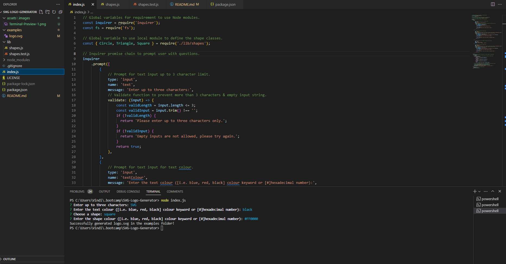
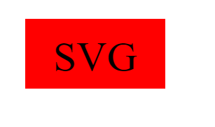

# SVG-Logo-Generator

## Description
A professionally easy-to-use logo generator for your everyday needs! Or at least for your own personal usage. Uses Javascript & Node!  

Comes with the following features:  
* You can type up to 3 characters for the logo title.  
* Choose what colour you prefer for both the text & shape colour. Using hexadecimal numbers or keywords. 
* Choose between three different & distinct shapes. Circle, triangle, or square! 
 
Once you have chosen your desired features, the code will generate an SVG file under "logo.svg" located in the examples folder. Come and give it a try today! 
  
## Table of Contents
- [Installation](#installation)
- [Usage](#usage)
- [License](#license)
- [Contributing](#contribution)
- [Tests](#tests)
- [Links](#links)
- [Previews](#previews)
- [Credits](#credits)
- [Questions](#questions)
  
## Installation
Follow these instructions:  
1. Git clone this repository.  
2. Install [Node](https://nodejs.org/en).  
3. Use any git terminal like Git Bash or Visual Studio Code.
  
## Usage
For generating a SVG logo file using node modules based on user inputs during prompts. 
  
## License
This project is licensed under the MIT license.
  
## Contribution
Please use proper general rules for contribution and merging. Always git pull before you git push your changes. And no merge conflicts please.
  
## Tests
Use either of these commands to test:  
1. Usage: node index.js  
or  
2. Testing: jest test  

## Links
**Walkthrough:** [Link to the walkthrough video!](https://drive.google.com/file/d/1MvJ8kVKQY0GM9gqWJYKKH8jaoDkvYGYU/view)  
**Github Repo:** [Link to Github repository!](https://github.com/Heaveness/README-generator)  

## Previews
**Terminal:**  
  
 

**Results:**  
  

## Credits
**Websites:** W3schools, stackoverflow, & reddit  
**Instructor(s):** Ali Maqsood, Daler Singh  
**Assistant Instructor(s):** Shihan, Adam, Krishna, & Tareque Moatar  
**Institution:** University of Toronto  

## Questions
If you have any questions regarding the repo, please contact me at vindictuslbp@gmail.com. Or check with me through my Github profile: [Heaveness](https://github.com/Heaveness).